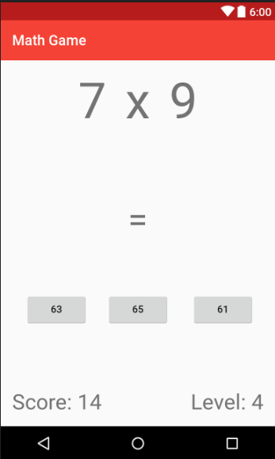

# MathGame
Android math game

The following project utilizes the Android Java Math Random libraries to create a simple math operation game. Users are asked random math questions each round, sound plays for correct/incorrect answers, and the score is incremented or decremented depending on whether the user answered the question correctly.

#Work in Progress(WIP)

